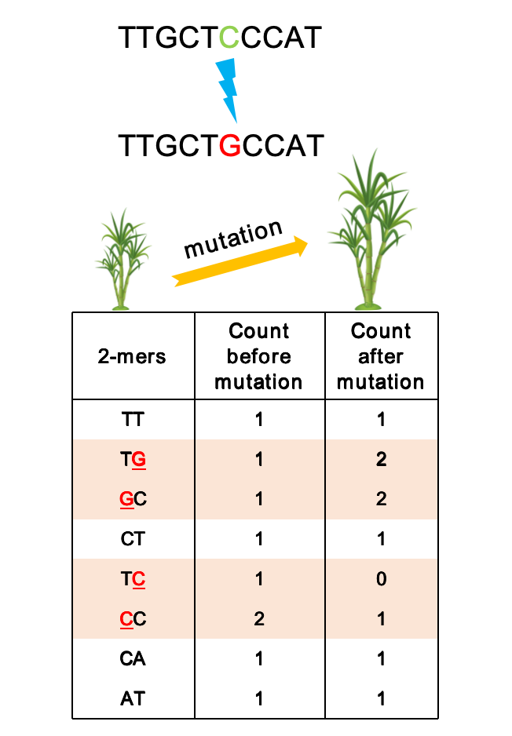

##        KMERIA

### A KMER-based genome-wIde Assocation testing approach on polyploids 




## Table of Contents

- [Introduction](#intro)
- [Features](#features)
- [Prerequisites](#prere)
- [Installation](#install)
- [Getting Started](#started)
  - [KMERIA pipeline (easy mode)](#easymode) [Wiki](https://github.com/Sh1ne111/KMERIA/wiki/Pipeline-(Easy-Mode))
  - [KMERIA overview (detailed steps)](https://github.com/Sh1ne111/KMERIA/wiki/Detailed-Step-by-Step-Tutorial))
- [Miscellaneous](#misc)
- [Contact](#contact)
- [Citation](#citing)


## <a name="intro"></a> Introduction

This repository contains an implementation of a k-mer-based method for Genome-Wide Association Studies (GWAS) in complex polyploid organisms (e.g., sugarcane, potato, sweetpotato, alfalfa，...). The approach is equally applicable to diploid species. By leveraging k-mer abundance profiles and statistical modeling, the method identifies associations between genetic variants and phenotypic traits.

## <a name="features"></a> Features

- **Enhanced Genetic Variability Detection:** KMERIA can capture a wider range of genetic variants, including structural variations and copy number variations, which are often overlooked in traditional GWAS.

- **Independent of Reference Genomes:** KMERIA do not rely on a reference genome in steps to identify genotypes, making them suitable for organisms with complex and variable genomic architectures, such as auto-polyploids.

- **Improved Additive effect Estimation:** The analysis of k-mer copy number can provide more efficient estimates of additive effects in auto-polyploid species, allowing for better interpretation of genotype-phenotype relationships.

- **Facilitated Genotype Identification:** KMERIA reduce the complexity of identifying genotypes in polyploids, facilitating faster and more efficient association analyses.

## Recent updates

* KMERIA Version 2.0.1 (2025.10.30):
  - K-mer matrix construction is now more efficient and consumes fewer resources;
  - Updated filter step to use new compressed output format;
  - Enhanced m2b step with BGZF compression and statistics;
  - Updated the association step to use our newly implemented Association tool **bimbamAsso**

* KMERIA Version 0.0.1 (2024.10.14) is no longer be maintained

## <a name="prere"></a> Prerequisites

- C/C++ compiler
- GNU make 
- Linux system

## <a name="install"></a> Installation
```bash
   
   # Clone the KMERIA repository:
   git clone https://github.com/Sh1ne111/KMERIA.git

   # To avoid GNU C++ Runtime Library conflicts, you can create a conda virtual environment to ensure all dependent libraries are installed correctly.
   conda env create -f kmeria_env.yml
   conda activate kmeriaenv 

   # htslib
   export LD_LIBRARY_PATH=/your_path/KMERIA/lib:$LD_LIBRARY_PATH

   # Change Permissions
   chmod 755 /your_path/KMERIA/bin/*
   chmod 755 /your_path/KMERIA/external_tools/*
   chmod 755 /your_path/KMERIA/bimbamAsso/*

   # For source installations
   make && make install
   make clean

   #Add PATH environment
   export PATH=/your_path/KMERIA/bin:/your_path/KMERIA/bimbamAsso:/your_path/KMERIA/external_tools:$PATH
```


## <a name="quick-start"></a> Quick Start

KMERIA provides a wrapper script `kmeria_wrapper.pl` to generate job scripts for the entire pipeline, with support for SLURM, SGE, and PBS schedulers.

```bash
perl /KMERIA/scripts/kmeria_wrapper.pl --step all \
  --input /path/to/fastq_files \
  --output /path/to/kmeria_results \
  --samples sample.list \
  --threads 32 \
  --kmer 31 \
  --min-abund 5 \
  --max-abund 1000 \
  --batch_size 2 \
  --use-kmc \ # Optional, default: kmeria count
  --kmc-memory 32 \ # Optional, default: kmeria count
  --ploidy 4 \
  --depth-file /path/to/sample_depths.txt \
  --pheno /path/to/phenotypes.txt \
  --pheno-col 1 \
  --use-bimbam-tools \  # Optional: Use 'bimbamAsso' instead of 'gemma'
  --scheduler slurm \
  --queue hebhcnormal01
```

### ➡️ **Full Pipeline and Documentation**

For detailed, step-by-step instructions, parameter explanations, and advanced usage, please visit our comprehensive [**KMERIA Wiki**](https://github.com/Sh1ne111/KMERIA/wiki).

- **[Pipeline (Easy Mode)](https://github.com/Sh1ne111/KMERIA/wiki/Pipeline-(Easy-Mode))**: Detailed breakdown of the `kmeria_wrapper.pl` parameters.
- **[Detailed Step-by-Step Tutorial](https://github.com/Sh1ne111/KMERIA/wiki/Detailed-Step-by-Step-Tutorial)**: A complete walkthrough of the entire KMERIA workflow, from raw reads to association results.
- **[Post-GWAS Analysis](https://github.com/Sh1ne111/KMERIA/wiki/Post-GWAS-Analysis)**: Guides on mapping associated k-mers and reads.

## <a name="command-overview"></a> Command Overview
```
#===============================================================================#
#                                                                               #
#                 _  ____  __ ______ _____  _____                               #
#                | |/ /  \/  |  ____|  __ \|_   _|   /\                         #
#                | ' /| \  / | |__  | |__) | | |    /  \                        #
#                |  < | |\/| |  __| |  _  /  | |   / /\ \                       #
#                | . \| |  | | |____| | \ \ _| |_ / ____ \                      #
#                |_|\_|_|  |_|______|_|  \_\_____/_/    \_\                     #
#                                                                               #
#===============================================================================#

Program:  KMERIA - A KMER-based genome-wIde Association testing approach
          for polyploids

Version:  v2.0.1 (r: 2025-10-14)
Author:   Chen Shuai <chensss1209@gmail.com>
GitHub:   https://github.com/Sh1ne111/KMERIA

Usage:    kmeria <command> [options]

Commands:

  Data Processing:
    count      Count k-mers from FASTA/FASTQ files
    dump       Convert binary k-mer file to plain text
    kctm       Build population k-mer counting matrix
    filter     Filter k-mer matrix by frequency and quality

  Format Conversion:
    m2b        Convert k-mer matrix to BIMBAM dosage format
    b2g        Convert BIMBAM format to genotype format

  Analysis:
    sketch     Random sampling for PCA and kinship calculation
    asso       Conduct k-mer genome-wide association study

  Utilities:
    fkr        Fetch reads associated k-mers from FASTQ files
    fkrtgs     Fetch reads associated k-mers from TGS FASTQ files
    kbam       Extract reads associated k-mers from BAM files
    addp       Annotate BAM with association p-values

Additional Help:
    kmeria <command> -h     Show detailed help for specific command
    Visit https://github.com/Sh1ne111/KMERIA for documentation

#===========================================================================#
#  Citation: If you use KMERIA, please cite our paper at [Journal/DOI]      #
#===========================================================================#
```


## <a name="misc"></a> Miscellaneous Tools

KMERIA also includes several utility scripts located in the `/bin` and `/scripts` directories:

- `/bin/retrieve`: Get k-mer dosage from filtered k-mer counting matrices.
- `/scripts/calc_gwas_threshold_new.R`: Calculate the GWAS significance threshold.
- `/scripts/plot_manhattan.R`: Helper script for plotting Manhattan plots.

Usage instructions are available on the [**Wiki**](https://github.com/Sh1ne111/KMERIA/wiki).

## <a name="contact"></a> Contact

For questions or feedback, please contact [Chen Shuai] at [chensss1209@gmail.com].

## <a name="citation"></a> <span id="citing">Citation</span>

If you have used KMERIA in your research, please cite below:

> https://github.com/Sh1ne111/KMERIA
>
> Chen Shuai, et al., A k-mer-based GWAS approach empowering gene mining in polyploids. (paper preparation)
